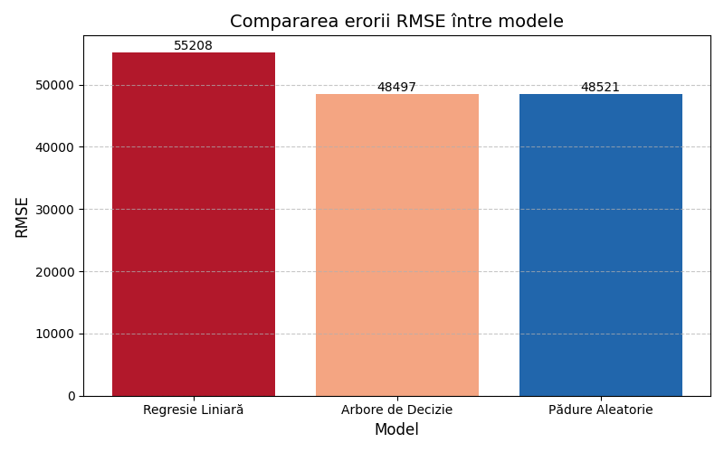
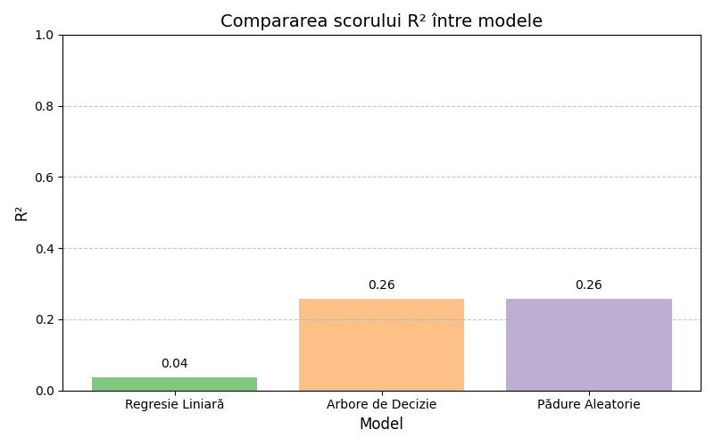

# Learning Analytics – ACS 2013 (PySpark)

Proiect realizat în cadrul disciplinei **Learning Analytics**, având ca obiectiv analizarea factorilor socio-demografici care influențează venitul personal (PINCP), utilizând setul de date [2013 American Community Survey](https://www.kaggle.com/datasets/census/2013-american-community-survey).

## 🔍 Scop
Predicția venitului pe baza vârstei, sexului, rasei și nivelului educațional, folosind modele MLlib din Apache Spark.

## ⚙️ Tehnologii
- Python 3.8
- PySpark MLlib
- pandas, matplotlib
- PyCharm IDE

## 📊 Modele utilizate
- Regresie Liniară  
- Arbore de Decizie  
- Pădure Aleatorie (Random Forest)

## 📈 Rezultate
Modelul **Random Forest** a obținut cele mai bune performanțe:
- RMSE ≈ 48.5  
- R² ≈ 0.26  





## ▶️ Rulare locală

- In directorul data/ trebuie descarcat si adaugat fisierul CSV din kaggle (https://www.kaggle.com/datasets/census/2013-american-community-survey?select=ss13pusa.csv  )

```bash
pip install -r requirements.txt
python main.py
