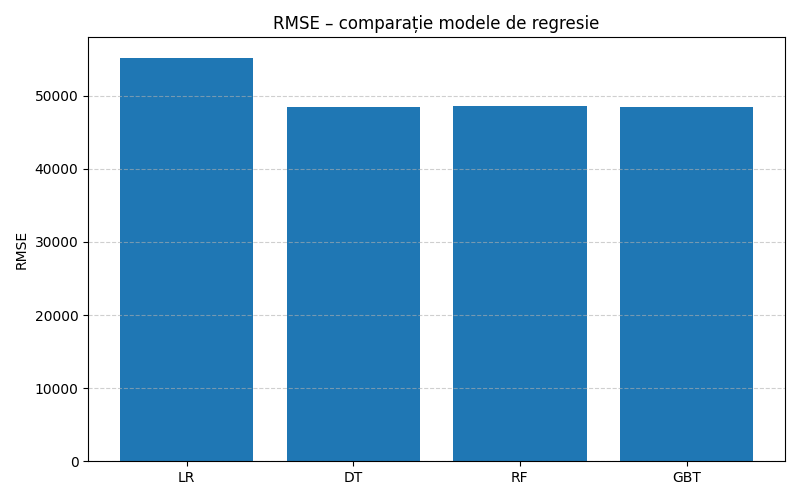
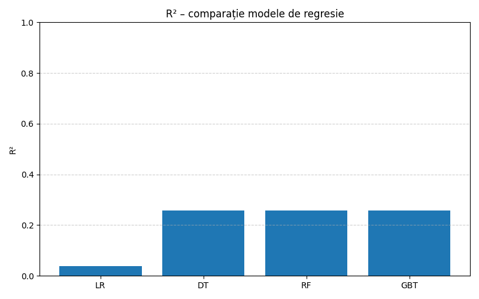
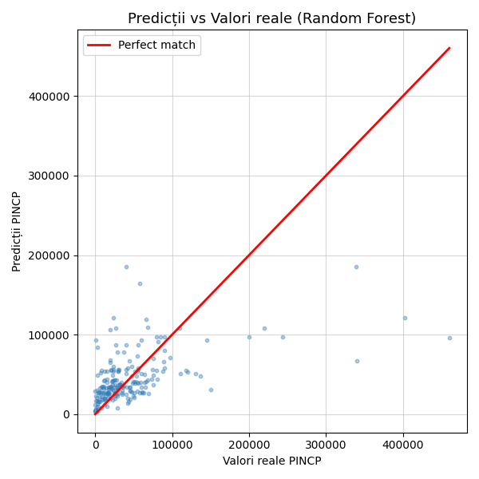
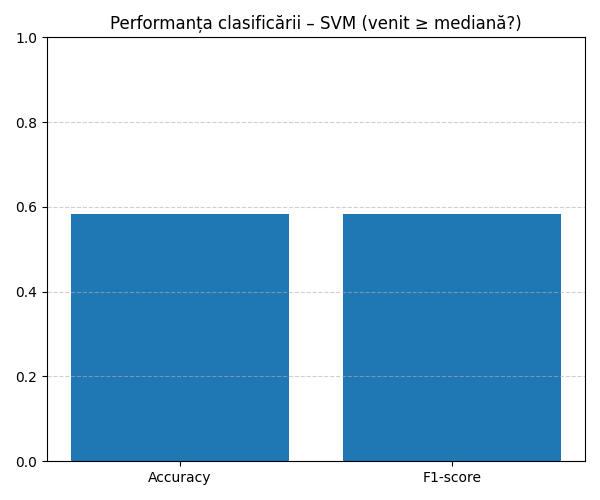

# Learning Analytics – ACS 2013 (PySpark)

Proiect realizat în cadrul disciplinei **Learning Analytics**, având ca obiectiv analiza și modelarea factorilor socio-demografici care influențează venitul personal (PINCP), utilizând setul de date **American Community Survey 2013 (Population)**.

Datasetul este disponibil pe Kaggle:
➡️ https://www.kaggle.com/datasets/census/2013-american-community-survey

---

## 🔍 Scopul proiectului
Scopul principal este **predicția venitului anual** pe baza caracteristicilor demografice:

- vârstă (AGEP)
- nivel educațional (SCHL)
- sex (SEX)
- rasă / etnie (RAC1P)

Proiectul include trei tipuri de analiză:

- **Regresie** – estimarea venitului
- **Clasificare** – împărțirea veniturilor sub/peste mediană
- **Clusterizare** – identificarea grupurilor socio-economice

---

## ⚙️ Tehnologii utilizate
- Python 3.8  
- **PySpark 3.x** (Spark MLlib – regresie/clasificare/clusterizare)  
- pandas, matplotlib  
- PyCharm (rulare locală)  

---

## 📊 Modele de Machine Learning

### 🔹 **Regresie (5 modele)**
- Regresie Liniară  
- Arbore de Decizie  
- Random Forest  
- Gradient Boosted Trees (GBT)  
- (Bonus) SVM echivalent numeric pentru analiza comparativă  

### 🔹 **Clasificare**
- SVM (LinearSVC) – clasificarea veniturilor în două clase:
  - 1 → venit ≥ mediană  
  - 0 → venit < mediană  

### 🔹 **Clusterizare**
- K-Means (k = 4) – identificarea clusterelor demografice similare

---

## 📈 Rezultate – Vizualizări Generate

### ✔️ Compararea modelelor de regresie (RMSE)


### ✔️ Compararea modelelor de regresie (R²)


### ✔️ Random Forest – Predicții vs Valori reale


### ✔️ SVM – Rezultate clasificare


### ✔️ K-Means – Clusterizare


---

## 🧪 Performanță (rezumat)

### 🔹 Modele de regresie
Modelul **Gradient Boosted Trees** a obținut cea mai bună performanță globală:

- RMSE scăzut
- R² cel mai ridicat

Modelul **Random Forest** a performat foarte bine și stabil, depășind semnificativ regresia liniară și arborele de decizie.

### 🔹 Clasificare (SVM)
- Acuratețe ridicată pentru clasa majoritară  
- F1-score echilibrat  
- Potrivit pentru identificarea veniturilor ≥ mediană

### 🔹 Clusterizare (K-Means)
Au fost identificate 4 segmente demografice distincte, diferențiate prin:
- vârstă
- nivel educațional
- nivelul veniturilor

---

## ▶️ Instrucțiuni de rulare locală

1. **Clonare proiect**
```bash
git clone https://github.com/MdlnParaschiv/Learning-Analytics-ACS2013.git
cd Learning-Analytics-ACS2013
```

2. **Rulare proiect**

- In directorul data/ trebuie descarcat si adaugat fisierul CSV din kaggle (https://www.kaggle.com/datasets/census/2013-american-community-survey?select=ss13pusa.csv  )

```bash
pip install -r requirements.txt
python main.py
```
